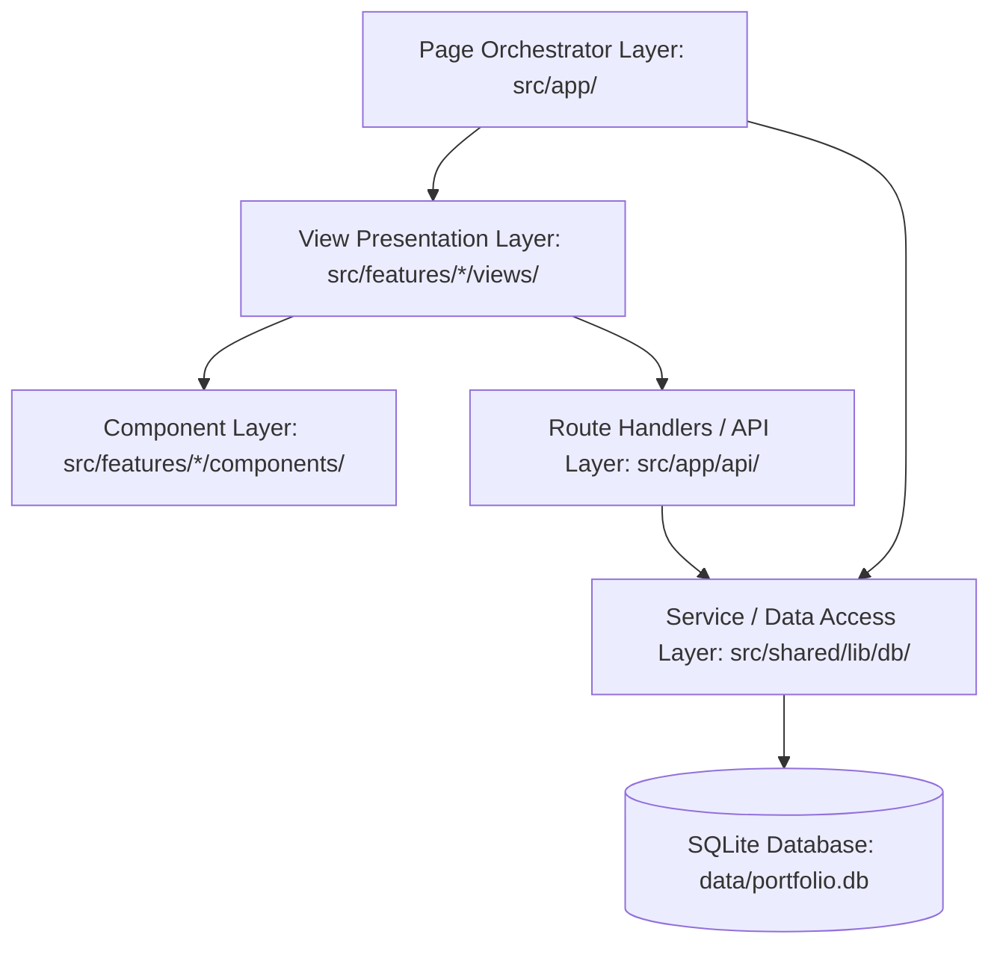

# Architecture Standards & Documentation

## Overview

This repository is built with **Next.js 16 (App Router)** and follows a **Feature-Driven / Vertical Slice Architecture** combined with a clean **Three-Tier Separation of Concerns**.

## Architecture Layers

### 1. Page Orchestrator Layer (`src/app/`)
- Handles Next.js routing, metadata generation, and initial server-side data fetching.
- Delegates UI rendering to presentation views from `src/features/<feature>`.
- Examples:
  - `src/app/admin/projects/page.tsx`
  - `src/app/admin/articles/page.tsx`
  - `src/app/projects/page.tsx`
  - `src/app/blog/page.tsx`

### 2. View Presentation Layer (`src/features/<feature>/views/`)
- Assembles domain-specific components into cohesive views.
- Receives server props and manages high-level feature state and notifications.
- Examples:
  - `src/features/admin/views/AdminProjectsView.tsx`
  - `src/features/admin/views/AdminProjectFormView.tsx`
  - `src/features/admin/views/AdminArticlesView.tsx`
  - `src/features/admin/views/AdminArticleFormView.tsx`

### 3. Component Layer (`src/features/<feature>/components/`)
- Local, focused UI components (tables, modals, forms, cards).
- Styled using Material UI primitives with customized CSS variables (`--color-canvas`, `--color-ink`, `--color-primary`, `--color-surface-card`, etc.).
- Public API barrier: All feature components and views are exported exclusively through each feature's `index.ts`.

### 4. Database & Service Layer (`src/shared/lib/db/`)
- Isolated server-only database access directly using `better-sqlite3` (no ORM).
- Uses prepared and parameterized SQL statements for complete SQL injection protection.
- Automatically initializes schema and seeds default data on first start.
- SQLite WAL (Write-Ahead Logging) mode enabled for high concurrency and resilience.

### 5. API / Route Handler Layer (`src/app/api/admin/`)
- Next.js Route Handlers exposing standard REST endpoints:
  - `GET /api/admin/projects` & `POST /api/admin/projects`
  - `GET /api/admin/projects/[id]`, `PATCH /api/admin/projects/[id]`, `DELETE /api/admin/projects/[id]`
  - `GET /api/admin/articles` & `POST /api/admin/articles`
  - `GET /api/admin/articles/[id]`, `PATCH /api/admin/articles/[id]`, `DELETE /api/admin/articles/[id]`
- Server-side payload validation, sanitized error messages, and HTTP status codes (200, 201, 400, 404, 409, 500).
